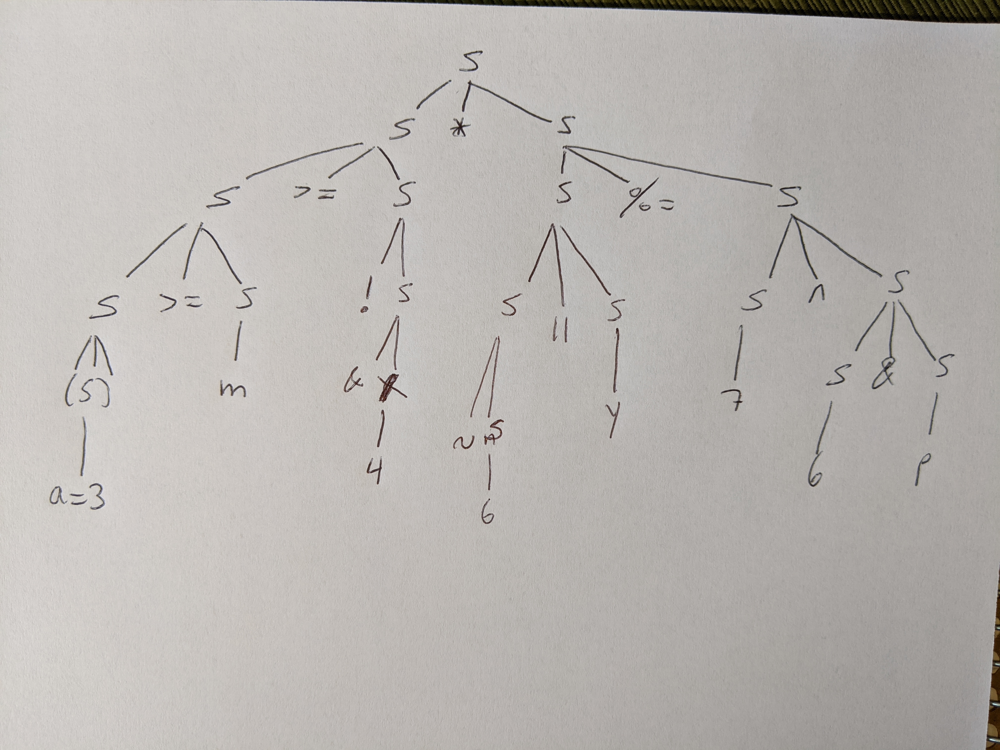

# Homework 6

**3. What programming paradigm started taking over the world in the 1980s?**
Object Orientation

**4. In Bret Victor’s The Future of Programming, what are the four “predictions” his 1973 persona predicted for 2013 that never really took hold?**
    - Direct manipulation of data
    - Programming using goals and constraints
    - Spatial representations of information
    - Concurrent programming model

**11. What is the difference between imperative and delcarative programming?**
Imperative is explicit, programming with sequence of commands that update state. However, declarative is implicit, programming by specifying what the result should look like, not how to get it.

**15. Syntax deals with _______________. and semantics deals with _______________.**
structure; meaning.

**20. What is the difference between concrete syntax and abstract syntax?**
Concrete syntax refers to what the implementation looks like. In the other hand, an abstract syntax refers to what are the significant parts of the implementation.

**24. What are denotational semantics, operational semantics, and axiomatic semantics?**
Operational semantics: semantics approach concerned with how to execute a program and not merely what the results of execution are.
Denotational semantics: approach in which we are merely interested in the effect of executing a program.
Axiomatic semantics: approach based on mathematical logic interested in proving the correctness of programs.

**28. What is an assignable? How does assignment differ from binding?**
Assignment means changing the value of an entity, nevertheless, binding is just the attachment of a name to an entity.

**34. How does Python prevent a binding from outliving the entity it is bound to? How does Rust prevent this from occurring?**
Rust's compiler guarantees no dangling references: if we have a reference to some data, the compiler will ensure that the data will not go out of scope before the reference to the data does.
In Python, the garbage collector prevents us from dangling references.

**40. What would this program output under (a) static scope rules and (b) under dynamic scope rules?**
```javascript
var x = 2;
function f() { print x; }
function g() { var x = 5; f(); print x; }
g();
print x;
```
(a) In static scope, it will print 2, 5, 2
(b) In dynamic scope it will print 5, 5, 2

**45. What is the difference between the way JavaScript and Rust handle the sequence:**
    let x = 3;
    let x = 3;
In Javascript, it binds the variable x to 3, then, it rebinds the second 3 to x. However, in Rust, it binds the variable x to 3, then, it creates a completely new variable for the second x and bind it to 3 shadowing the first x.

**49. What is operator precedence? What does is mean for operator O1 to have higher precedence than operator O2? Give a precise example.**
Operator precedence determines the grouping of terms in an expression and decides how an expression is evaluated. An operator with a higher precedence means that it will be applied first. For instance, in `3 + 5 * 2` the second operator (*), has a higher precedence than the first operator (+), so 5 * 2 will be the first operation to be calculated.

**51. Evaulate, if possible, the expression in `-2**2` in JavaScript and Python. Explain why the evaluation produced the value it did in each language.**
In JS we get a Syntax Error because of operator associativity, the unary operator (-) and the exponentiation operator (**) have a right-associativity. At the same time, the unary operator (-) has a greater precednce than the exponentiation operator.
In Python, the answer is -4 because the exponentiation operator has a greater precedence than the unary operator(-).

**52. Why would a language define an evaluation order for expressions? Why would it choose to leave the evaluation order undefined?**
To know the order things have to take place. There might be aliasing that might change our answer. An evaluation order undefined makes the compiler decide the best order it can, it could be useful in parallel architectures.

**56. What does the following script output under lazy evaluation? Under eager evaluation?**
```javascript
let x = 5
function f() { x = x * 3 }
function g() { x = x * 5 }
function h(a, b) { return a + x }
print(first(f(), g()))
```
Under eager and lazy evaluation the output would be 15.

**59. How did Go “fix” the most uninutitive aspect of the C (and inherited by C++, JavaScript, Java) switch-statement?**
Go only runs the selected case, not all the cases that follow.

**60. Why is it that the simple act of doing an operation 10 times so easy in Ruby but so annoyingly complex in C-like languages?**$
Because in Ruby the designers thought about a better more friendly way for doing an operation 10 times, Ruby is the programmers best friend. This form is more intuitive than C, Java or JS.

**62. What is the non-deterministic statement of Go? Of Erlang?**
In Go we could use the select-case statement; in Erlang the receive statement.

**66. What are the main differences between a type and a class?**
While Type is all about behavior, class is all about structure and behavior. An object can have many types, nevertheless, an object belongs to exactly one class. Although, type is about interfacing and usage, class is about construction, fields, properties and methods.

**68. Why to languages like Ruby have a single type Array but in other languages like Java, Rust, and Swift there exist many parameterized array types?**$
Because parameterized array types let us do certain operations to the specific type of the parameter.

**72. What are three primary situations in which a type A is compatible with type B?**
- When A and B are the same type
- When A is a subtype of B
- When an A can be coerced to a B

**77. What is the difference between strong typing and weak typing?**
Strong typing is when type clashes amoung unrelated types result in errors. In weak typing clashes do not exist because the language implementation will try to cast the argument into some reasonable type and carry out the operation.

**78. What is the difference between static typing and dynamic typing?**
Static typing: The inference of and checking of types prior to execution.
Dynamic typing: The state of having types of some expressions not known until run time.

**80. Why is the combination of static typing plus weak typing the worst of the four possible combinations?**$
Because the language implementation will try to csat the argument into a reasonable type and it will do it prior compile time.

**85. Given the types A = {1, 2, 3} and B = {'a', 'b'}, what are the types A+B and A×B?**
A + B = {1, 2, 3, 'a', 'b'}
A x B = {(1, 'a'), (1, 'b'), (2, 'a'), (2, 'b'), (3, 'a'), (3, 'b')}

**86. Untagged product types are usually called ________________. Tagged product types are usually called ________________. (There are two good answers for the latter; one starting with “s” and one starting with “s”.**$
unions; structs

**90. In what way is a struct like a dictionary? In what why are they different?**
They are both tagged product types, so the name fields order may or may not matter; memory layout is often contiguous; the compilers may rearrange fields; we cannot compare them.

They differ in that structs are for structured collection of data and dictionaries are for long lists of named elements. A struct is kind of a variant of an array, while a dictionary is higher level structure.

**94. If someone talks about static arrays and dynamic arrays, what are they probably referring to?**
Probably, static arrays allocate memory at compile time (stack), we cannot modify the size, and dynamic arrays allocate memory at run time (heap), we can modify the size.

**96. How do Go and Rust differ (if at all) in their interpretation of the length of a string?**
In rust the length of a String is the number of bytes currently stored in a buffer, however, each character could take different bytes of storage depending on the unicode scalar value.
In the other hand, Go returns the number of characters in the string.

**102. What is the difference between a subroutine and a coroutine?**
Subroutine is an abstraction of a process that is called, here the caller waits for the subroutine to execute its body. In a coroutine, the execution could be suspended and resumed.

**103. What is the difference between a parameter and an argument?**
Parameter is a variable to which arguments are passed, but an argument is an expression passed to a (parameterized) entity during a call, instantiation, or other invocation.

**107. What is a rest parameter?**
A rest parameter is a parameter that collects extra paramater into a data structure like an array, list or dictionary.

**110. Explain the following five pragmatic mechanisms for argument passing (value, value-result, reference, name, pure-aliasing).**
| Mechanism     | Explanation   |
| ------------- |---------------|
| Value         | Argument value is copied to the parameter. The changes to the parameter are not reflected in the argument|
| Value/result  | Argument values is copied in. The parameter value is copied out at the end of calle     |
| Reference     | An implementation of aliasing through passing the address of the argument      |
| Name          | Parameter is similar to a macro, taking on the source code text of the argument   |
| Aliasing      | Argument and parameter are one. The changes to the parameter are reflected in the argument |

**117. Alan Kay said, in a letter to Stefan Ram, “OOP to me means only ________________, local retention and protection and hiding of ________________, and extreme ________________.”**
messaging; state-process; late-binding of all things.

**118. The two major approaches to OOP are characterized by ________________ and ________________. Which of the two is more associated with Plato and why?**
classes; prototypes
Classes is more associated with Plato. He refers to forms as abstract representations that are templates for real world objects. A class can serve as a template, it tells us which attributes are in the objects it produces.

**119. What might have caused the proliferation of getter and setter methods in languages like Java and C# that purport to be object oriented? What are the arguments as to why getters and setters are evil?**
The proliferation of getter and setter methods could have happened to standarized these methods because the implementation was the same across classes. Getters and setters are evil because they are not particularly object oriented; they can damage our code's maintainability; having getters and setters tells us that the program is not well designed form an Object Orientation perspective. In addition, they break the encapsulation principle and expose implementation details. Finally, we are not thinking like an object.

**122. Explain the difference between the Erlang-style and the Go-style of process communication.**
Go abstracts concurrency by using channels. The channels are used to send data to one or more routines. In Erlang, the parallel executions are called processes. Processes wait for something to be passed into their individual mailbox.

## Practice Problems
**Give the abstract syntax tree for the following C++ expression**$
```c++
(a = 3) >= m >= ! & 4 * ~ 6 || y %= 7 ^ 6 & p
```


**Show the output of the following, assuming dynamic scope and (a) deep binding, and (b) shallow binding.**$
```javascript
function f(a) {
  let x = a - 1
  function g() {
    print x - 17
  }
  h(g)
}
function h(p) {
  let x = 13
  p()
}
f(18)
```

Assuming static scope, the output will be (a) 0, (b) -4.
However, assuming dynamic scope: (a) 0, (b) 0

**If possible, write a program in Go that makes a variable point to itself. That is, for some variable x, make it so that *x == x. If this is not possible, state why it is not possible.**$
It's not possible, we cannot point to x and its location at the same time.

**The following pseudocode shows a midtest loop exit:**
```ruby
while (true)
    line := readLine();
    if isAllBlanks(line) then exit end;
    consumeLine(line);
end;
```
**Show how you might accomplish the same task using a while or repeat loop, if midtest loops were not available. (Hint: one alternative duplicates part of the code; another introduces a Boolean flag variable.) How do these alternatives compare to the midtest version?**

```ruby
done = false;
while (!done)
    line := readLine();
    consumeLine(line);
    if isAllBlanks(line) then done = true end;
```

**Explain what is printed under (a) call by value, (b) call by value-result, (c) call by reference, (d) call by name.** $
```javascript
x = 1;
y = 2;
function f(a, b) {a = 3; print b, x;}
f(x, x + y);
print x;
```
(a) 3, 1, 1
(b) 3, 1, 3 
(c) 3, 3, 3
(d) 3, 3, 3

**Given `let f = async x => 1` and `let g = async => 2` what do the expressions `f()` and `g()` return? Why? Why is the definition of `g` even acceptable?**$
f() returns a promise; however, g() returns 2 because javascript considers async just a parameter in a arrow-function.